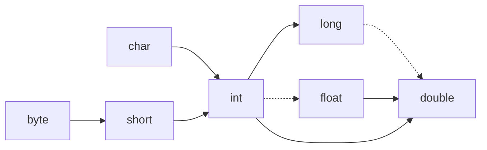

# Java核心技术卷一 基础知识

# 第3章 Java的基本程序设计结构

## 3.3 数据类型

### 整型：

| 类型 | 大小  | 范围                  |
| ---- | ----- | --------------------- |
| int  | 4byte | $-2^{31}$ ~ $ 2^{31}-1$ |
| short | 2byte | $-2^{15}$~$2^{15}-1$ |
| long | 8byte | $2^{63}$~$2^{63}-1$ |
| byte | 1byte | $2^{7}$~$2^7-1$ |

> Tips:长整型有后缀`l`或者`L`，十六进制数有前缀`0x 0X`，八进制有前缀`0`，二进制有前缀`0b 0B`，同时整型的字面常量可以加上`_`下划线来予以标识：`100_100_100`；

==无符号整型==：java中没有无符号整型，我们需要通过类的接口来使用，类似于:Byte，Int、Long、Short都提供了对无符号的接口方法：

`Byte.toUnsignedInt()`。

```java
byte a = -127;
int b = Byte.toUnsignedInt(a); //这样的操作下来b=129 1000 0001为它的二进制储存形式
```

### 浮点类型

| 类型   | 大小                                        | 范围                                       |
| ------ | ------------------------------------------- | ------------------------------------------ |
| float  | 4byte(1bit符号位+23bits尾数位+8bits阶码位)  | 最大$(2-2^{-23})*2^{127}$，精度大概在6~7位 |
| double | 8byte(1bit符号位+32bits尾数位+11bits阶码为) | 最大$(2-2^{-32})*2^{1023}$，精度大概在15位 |

> Tips:
>
> 1. 常见的小数字面值都会被java作为double类型对待，想要表示一个float类型的浮点数，需要用这样的形式`1.1f 1.1F`。当然为了明确我们使用的是double类型，我们可以使用D或者d后缀：`1.1D 1.1d`。
>
> 2. java中表示十六进制指数使用`p`而不是`e`,因为e为十六进制的14。但是此时也要注意，p后面的指数为10进制，而且底数为2。$5*2^{14}$十六进制应该表示为`0x5p14`而不是`0x5e14`。
>
>    ```java
>    double c = 0x5e14;
>    double e = 0x5p14;
>    // 24084.0 5*4096+14*256+1*16+4 = 24084
>    // 81920.0 5*2^14 = 81920
>    ```
>
> 3. 浮点数采用IEEE 754规范，有这样一些特殊情况：
>    NaN:(not a number)，阶码为全为1，尾数位不全为0，这样的数是没有定义的。
>    无穷大：，阶码全部为1，尾数全为0，根据符号位分为正无穷和负无穷。
>    Java为它们定义了`Double.Positive_INFINITY``Double.Nagative_INFINITY`和`Double.NaN`（float类型也有对应的常量哦），但是它们并没有什么实际使用意义，因为NaN有很多，任意两个并不相等：
>
>    ```java
>    double result = Double.NaN;
>    if (result == Double.NaN) {
>        System.out.println(1); // 这个比较始终为false
>    }
>    ```
>
>    判断是否为NaN，使用`Double.isNaN()`方法即可。
>
> 4. 浮点类型并不是一个值得信任的类型，因为二进制小数并不能有效表示任一个十进制小数：0.1(10)不可以被任一个二进制小数表示：
>
>    ```java
>    if (0.1 == 2.0-1.9) {
>        System.out.println(1); // 这也是永远无法达到的部分
>    }
>    ```
>
>    因为0.1本身就不能准确表示，就如同1/3不能被准确表示。

### 字符型

char类型占用2byte，通常不作为一种类型直接使用，而是作为String类的一个构成部分。其值从`\u0000`到`\uffff`(十六进制数)。其中`\u`为转义字符，表示为Unicode字符。其他的转义字符如下：

| 转义序列 | 名称   | Unicode值 |
| -------- | ------ | --------- |
| \b       | 退格   | \u0008    |
| \t       | 制表符 | \u0009    |
| \n       | 换行   | \u000a    |
| \r       | 回车   | \u000a    |
| \\"      | 双引号 | \u0022    |
| \\'      | 单引号 | \u0027    |
| \\\\     | 斜杠   | \u005c    |

> tips:
>
> 我们在编写任何java程序中，可以任意使用\u转义字符来指定对应的字符，它们会在预编译时候被直接替换，例如：
>
> ```java
> \u0053\u0079\u0073\u0074\u0065\u006d\u002e\u006f\u0075\u0074\u002e\u0070\u0072\u0069\u006e\u0074\u006c\u006e\u0028\u0022\u8fd9\u4e2a\u662f\u0055\u006e\u0069\u0063\u006f\u0064\u0065\u7f16\u7801\u0022\u0029\u003b
>     
>  // 这段java代码也可以编译通过，等价于：System.out.println("这个是Unicode编码");
> ```
>
> 所以在任意时候，我们使用\u符号都要注意！！

> ### Unicode编码机制：
>
> 每个字符被用一个码点表示，一个码点可以用一个或者两个代码单元（一个代码单元为一个char，2byte）容纳，大小为2byte~4byte。它们之间有特殊的转换算法：
>
> ```java
> String s = "\uD835\uDD46";
> System.out.println("\uD835\uDD46");
> for (char x:"\uD835\uDD46".toCharArray()) {
>     System.out.printf("0x%x\n", (int)x);
> }
> System.out.println("0x" + Integer.toHexString(s.codePointAt(0)));
> System.out.printf("%d", "占用byte:\uD835\uDD46".getBytes(StandardCharsets.UTF_8).length);
> 
> // 上面的字符串为𝕆，占用两个代码单元（两个char），自身为一个码元，上面的输出为
> /*
>     𝕆
>     0xd835
>     0xdd46
>     0x1d546
>     15
> */
> // 显示出来的结果表明该字符前两位char值为d835、dd46但是转为int值为1d546,之间包含了某种特别的算法
> ```
>
> ==待补充==

### 布尔类型

布尔类型只有两个值，true和false。

> tips:java中布尔类型可转换性很差，不可以与int等数值类型互相转化，如果想让数值类型映射到boolean类型，必须要通过相关语句，常用的语句如：
>
> ```java
> boolean flag = (x == 0) ? false : true;
> ```

## 3.4变量与常量

### 变量

> tips:变量如果可以从变量的初始值推断出类型，不需要声明具体的数据类型，而是可以使用类型说明符`var`（类似于C++的auto，可以自动判别变量的类型）
>
> ```java
> String s = "hello";
> for (var c : s.toCharArray())
>     System.out.println(c);
> ```
>
> 

### 常量

> tips:常量使用`final`而不是C++中的const，常量的命名尽量使用全大写。
>
> ```java
> final double PI = 3.1415926;
> ```

### 枚举类型

枚举类型定义的一个定义的有限的变量的集合，属于该枚举的变量只能从该集合中取值，枚举只包含有限个值；

> tips：枚举的内部实现是不同于C++中的实现的，枚举的每次定义必须在主类外！
>
> ```java
> enum Size{
>         LARGE,
>         SMALL
>     }
>     public  static void main(String[] args) {
>     Size s = Size.LARGE;
>     System.out.println(s);
>     }
> ```

## 3.5 运算符

> ### 算术运算的计算扩展
>
> 对于java的设计理念，希望所有的java程序都可以在不同的机器上都可以通过java虚拟机运行并产生相同的结果，但是对于乘法和除法（模数）运算，不同CPU对于其处理去不尽相同，很多Intel CPU在计算乘法时，会做位扩展处理：
>
> ​		对于int\*int，计算32位乘32位，结果理论上最大需要64位，这时候就会进行位扩展，计算机会将计算结果存在两个固定的寄存器中，然后在进行舍入处理，由此来保持最大的精确度，最后获得一个32位的结果。
>
> 但是java如果使用这样的处理可能会在不同的机型产生不同的结果，这与设计理念不相符，但是更优的性能和更好的结果，java还是选择了通过位扩展来提升计算精度（在某一个版本，java曾要求每次中间计算过程都要进行阶段），我们也可以在类方法前加上`strictfp`，类中所有运算都将采用严格阶段的浮点运算。

==待补充==

### Java中的数学函数和常量

列举一些值得讨论的数学函数：

> `Math.sqrt(double x)`平方根
>
> `Math.pow(double, double)`平方
>
> `Math.floorMod(double, double)`获取大于0的余数，原始的%取模运算的到的结果可能存在负值。
>
> `Math.exp(double)`自然数指数
>
> `Math.PI`，π的近似值
>
> `Math.E`自然数对数的值
>
> `Math.round(double)`获得最接近的整数值
>
> `Math.sin`正弦
>
> `Math.cos`余弦
>
> …其他想要使用的数学函数均可以在Math类中找到对应的方法。

> tips:Math类的所有方法在对浮点数进行运算时均使用CPU浮点运算单元的例程，这有可能导致在不同机型上运行的结果不相同，如果我们想在不同计算机上获得可预测的结果，可以使用`StrictMath`类，他能保证在所有平台获得相同的运算结果。
>
> 我们可以提高Math类的使用来提高我们运算的可靠性，对于乘法3*10^9赋值给赋值给int，它将会移除而不产生任何说明，我们可以替代使用`Math.multiplyExact(double, double)`，这样当发生溢出程序就会自动抛出一个异常，产生相同动作的方法还有：
> `Math.addExact``Math.subtractExact``Math.incrementExact``Math.decrementExact`和`Math.negateExact`

### 类型转换




对于图中的基本类型，实现表示可以实现无损失转换，虚线表示可能有数据损失（可以传递，byte可以无丢失的转为除char外的所有类型）。

我们可以主动进行类型转换，因为有些时候我们必须要进行一些类型的转换才能编译程序，通过`(类型名)`的语法形式可以进行转换：

```java
double a = 128.97;
int b = (int) a;
int c = (int) Math.round(a);
byte d = (byte) b;
System.out.printf("a = %.2f ; b = %d ; c = %d; d = %d", a, b, c, d);
// 输出为 a = 128.97 ; b = 128 ; c = 129; d = -128
```

`Math.round`获得了最临近的整数值，但是类型为long，需要通过类型转换！，（byte）的最大值为127,128大于了127，原本128（int类型)的二进制值后8位为`0b1000 0000`对应的byte值为-128。

> tips:千万要注意到强制类型转换中的损失，就如上例，可能是正负数的天差地别，溢出将会导致巨大误差。
>
> 不要试图对`boolean`类型做任何的转换，因为java并不对其进行支持，如果想将boolean转为int，可以用这样的表达式:
> `flag?0:1`。

### 值得讨论的一些运算符

`++` `--`:这两个运算符分为前缀和后缀形式，前缀表明先进行变量的自增，然后再参与运算；后缀则先参加运算，之后再实现自增：

```java
int a = 0;
int c = a++ + 5;
a = 0;
int d = ++a + 5;
System.out.println(c);
System.out.println(d);
// 结果输出分别为5 6
```

`+= -= *= /=`：由一个等号和一个二元运算符组成新的运算符，含义等价与：a /= 3 <==> a = a/3;所有结合运算符都是如此，它只是作为一种简写类型。

`&&` `||`:它们分别是逻辑与与逻辑或，两边操作的运算内容必须为boolean类型！而且它们也使用短路原则（即当检查第一个条件如果满足判断最后结果，后面的检查条件将不会被计算），我们可以这样使用短路原则来编写健壮的代码：

```java
if (a==0 && 15%a > 15/a) //这样当第一个判断发现除数为0，后面可能出错的代码就不会执行
```

但是短路原则也会造成错误：

```java
while (a-- > 0 && b++ > 0) // 我们想要更快捷的对b执行自加运算，但是一旦当a < 0成立，可能跳过一次自加的执行
```

而且注意，&&运算优先级高于`||`

`?:`:这是一个三元运算符，等价于`if else`语句：`a = flag?1:0 <==> if (flag) a=1; else a = 0;`

`&` `|` `^` `~`:经典的位运算，与、或、异或、非；

`>>` `>>>` `<<`:位移操作，对于左移操作，损耗左侧位，右侧位自动补充0，对数字符号没有影响；但是对于右移操作，数字为会损耗右侧位但是左侧位作为符号，补充0或者1有很多值得斟酌的地方：逻辑右移，`>>>`只移动位，不考虑符号，补充0；算术右移，`>>`移动位的同时更具数字符号来决定填充0或者1。

```java
int a = -100;
a = a>>1;
System.out.println(a);
a = -100;
a = a>>>1;
System.out.println(a);
/* 输出为
-50
2147483598
*/
```

所以当我们企图通过移位运算来快捷执行除法时，一定要使用算术右移；单纯只考虑移位是要使用逻辑右移。

`()`：括号提高运算优先级，括号内的内容优先计算。

### 运算优先级和结合方式

下表由上到下优先级逐渐降低：

| 运算符                                                       | 结合性 |
| ------------------------------------------------------------ | ------ |
| `[]` `()` `.` `方法调用`                                     | 左     |
| `!` `~` `++` `--` `+`（一元运算）`-`（一元运算） `(type)`（强制类型转换）`new` | 右     |
| `*` `/` `%`                                                  | 左     |
| `+` `-`(二元)                                                | 左     |
| `<<` `>>` `>>>`                                              | 左     |
| `<` `<=` `>` `>=` `instanceof`                               | 左     |
| `==` `!=`                                                    | 左     |
| `&`                                                          | 左     |
| `^`                                                          | 左     |
| `|`                                                          | 左     |
| `&&`                                                         | 左     |
| `||`                                                         | 左     |
| `?:`                                                         | 右     |
| `=` `+=` `-=` `*=` `/=` `%=` `&=` `|=` `^=` `<<=` `>>=`  `>>>=` | 右     |

在运算中执行先结合再运算，然后考虑优先级再进行运算。

> tips：为了表意清除和程序运算正确性，不能单独依赖于运算符的优先级，我们可以尽可能多使用括号来帮助我们运算。

## 3.6 字符串

字符串在java中的本质是Unicode字符序列，它不属于内置类型（类似char），它为Java库中定义的一种预定义类，我们所使用的每个用双引号括起来的字符串都为String类的对象，算是一种匿名对象。

### 字符串的属性

1. 不可变性！：
   字符串本身在创建后是一个常量，本身不可修改，String类也没有修改字符串的方法。首先明确一点，字符串作为类，Java中的运算符比较对Java类没有实质意义：

   ```java
   String s =  "a";
   String s1 = new String("a");
   System.out.println(s);
   System.out.println(s1);
   if (s1 == s) {
       System.out.println("equal");
   }
   // a
   // a
   ```

   上面两个字符串变量都为a，但是比较结果却为不等，因为Java的`==`比较的为java的地址，通过new操作我让s1变量拥有了不同于s的内存地址。

   ```java
   String s =  "a";
   String s_copy = s;
   s = "b";
   System.out.println(s);
   System.out.println(s_copy);
   /*
   b
   a
   */
   ```

   这个例子也表明，我们拷贝字符串s，拷贝了它的原始地址，再次给s赋值后，`s_copy`并没有随之改变，而是继续保存着之前s的值，更改s的值，只是改变了它的引用地址，而不是更改了字符串本身！字符串本身是不可变的。

   ```java
   String s =  "a";
   String s1 = "a";
   if (s == s1)
       System.out.println(s);
   // a
   ```

   最后一个例子，我们发现这次在比较中s和s1拥有相同的地址（当然他们也拥有相同的值），因为java中的所有字符串都被放入一个公共的储存池中，不同字符串如果赋值相同，它们将会引用相同的内存区域，这时候用`==`地址比较符比较时它们自然也是相等的！

   java使用公共的字符串共享池来存储字符串，因为我们程序中使用的字符串大多数是不需要进行改变的，通过字符串的共享，能够大大提高储存空间的利用率。但是对于需要经常修改字符串内容的程序，这样的效率也会大大降低：

   ```java
   String s = "0"
   for (int i = 0; i < 100; ++i) {
   	s += "!";
   }
   ```

   这个程序循环了100次，创建了100个新的字符串在字符池！！对此java也有对应的类`StringBuilder`和`StringBuffer`来对相同地址字符串进行修改操作，提高运行效率。[（字符串的修改）](# 字符串的修改)

2. 字符串中的空串和Null。

   字符串中的空串指`“ ”`，而Null指的是java中所有类都共享的一个空的引用`Null`，作为null值有着很大的隐患，我们无法在任何一个null值上调用方法，不然会出现错误。java中判别空串使用
   `str.length() == 0`或者`str.equals("")`。
   
   而判别使用字符串是否为Null使用。
   
   `str == null`
   
3. 字符串的实现
   java中的字符串使用char值的序列构成，前面说过char为使用UTF-16编码的表示Unicode码点的代码单元，一个Unicode字符对应一个码点，一个常用码点用一个代码单元可以表示，辅助字符则需要两个代码单元。有特例就是对于只含单字节代码单元的字符串底层使用byte数组实现。

   基于这样的字符串实现，根据Java String API，我们有下面遍历字符串的策略：

### 字符串遍历

   1. 遍历整个字符数组（按照代码单元遍历）,对于特殊情况只存在常见的单字节代码单元字符（对于中文也试用，因为中文字符一般在2byte)。

      ```java
      String a = "hello";
      for (int i = 0; i < a.length(); ++i) {
      	System.out.println(a.charAt(i));
      }
      ```

      也可以使用类提供的接口方法来更快完成这样的工作：

      ```java
      for (var x: a.toCharArray()) {
      	System.out.println(x);
      }
      ```

   2. 但是对于存在复杂双字节辅助字符的字符串，这样遍历可能会出现问题，对于串：`hello你好🍺`，我们使用上面的策略：

      ```java
      /*结果为
      h
      e
      l
      l
      o
      你
      好
      ?
      ?
      */
      ```

      最后的啤酒符号因为占用两个byte，当以char大小遍历时，自然会解析错误，这时候，为了更准确的访问每个字符（码点），通过下面的方法遍历：

      ```java
      String a = "hello你好🍺";
      for (int i = 0; i < a.length(); ++i) {
          int []cp = new int[1];
          cp[0] = a.codePointAt(i);
          String temp = new String(cp, 0, 1);
          System.out.println(temp);
          if (Character.isSupplementaryCodePoint(i)) ++i; // Suplementary补充的；我们通过发现为一个字符如果是占用两位的码点我们就将索引多加1，注意！！codePointAt是基于字符数组的索引！而不能识别码点的索引！！
      }
      ```

      对于反向遍历，我们可以这样：

      ```java
      String a = "hello你好🍺";
      for (int i = a.length()-1; i >= 0; --i) {
          if (Character.isSurrogate(a.charAt(i))) i--;
          int [] cp = new int[1];
          cp[0] = a.codePointAt(i);
          System.out.println(new String(cp, 0, 1)); //Surrogate替代的；我们查看该字符是否为第二个，这样索引减去1转到第一个字符
      }
      ```

      这里用到了`String`的构造方法：`new String(int []cp, int offset, int count);`通过码点值的数组，第一个转化的值，总共的转化树来获得一个String对象。

      类似于char数组的遍历，我们也可以通过下面的方法：

      ```java
      String a = "hello你好🍺";
      for (var x:a.codePoints().toArray()) {
          int []cp = new int[1];
          cp[0] = x;
          System.out.println(new String(cp, 0, 1));
      }
      ```

### 字符串操作

1. 提取子串。
   通过方法：`substring(int beginIndex, int endIndex);` `substring(int beginIndex);`这个方法通过指定开始索引（从0开始），和终止索引，终止索引的字符不选用，终止索引最大为`str.length()`(正如你所想的，这样的方法也会受到双字节码点的制约，后面Tips会介绍解决方案）

2. 拼接串。
   我们可以简单的通过重载的`+`运算符来拼接字符，但是它会开辟新的内存空间来容纳这个新的字符：

   ```java
   String s1 = "hello";
   String s2 = " world!";
   s1 += s2;
   System.out.println(s1);
   ```

   它的实质是这样的

   

   我们还有一些方法来拼接串：
   `String.join(CharSequence delimate, CharSequence element...)`这个方法在第一个参数上放上分隔符，之后n个字符串将合并到一起，并且在每个子字符串中间会有一个分隔符。

   `repeate(int count)`，重复调用的串count次，然后返回这个串。

3. 比较串。
   有方法`equals(Object anObject);`比较任意可以与String转换的类与调用字符串之间是否相等，返回boolean值。
   同样还有方法`equalsIgnoreCase(String anotherString);`同一个字符串比较，不管他们的大小写。
   除了这些返回boolean类型的方法外，类似于C语言，有方法：`compareTo(String anotherString);`这个方法可以返回一个int值：当两个字符相同时返回0，否则返回第一个不相同字符的差（第一个串的字符减去第二个串的字符）。 
   
   ```java
   System.out.println("aas".compareTo("aar"));
   System.out.println("abc".compareTo("acb"));
   /*
   1
   -1
   */
   ```

### 字符串构建

传统的字符串构建，基于已经存在的字符串进行拼接，将会不断创建字符串占据储存空间，而且效率低下，为了一直在同样内存空间进行操作提高储存空间的利用，Java提供`StringBuilder` `StringBuffer`两个类完成这样的任务。

两个类拥有相同的方法，我们先以`StringBuilder`类为例，理解它的使用。`StringBuilder`类似于C语言的String，我们可以在任意位置对字符进行删除，插入和修改，然后最后我们通过`toString()`方法将它转化为String类对象。它使用的方法如下：
`length()`:构建器中的代码单元数目
`append(String str) append(char c)`：向构建器尾部添加字符串或者字符

`appendCodePoint(int cp)`:向构建器中添加一个码点

`setCharAt(int index, char c)`：设置指定索引的字符为c

`insert(int offset, String str) insert(int offset, char c)`：在指定索引上放入字符，后面字符右移。

`delete(int startIndex, int endIndex)`：删除指定范围的字符。

`StringBuffer`拥有和`StringBuilder`一样的方法，前者效率稍低，但是允许以多线程方式添加和删除字符；后者效率更高，而且如果在单个线程内对字符串进行编辑，就是用`StringBuilder`即可。

### String  API

列举一些上面没有出现过的可以使用到的String API：

`int offsetByCodePoints(int startIndex, int cpCount)`从startIndex开始cpCount个码点后的码点索引，如果超过索引则会抛出异常

`IntStream codePoints()`：返回一个字符串的码点流，可以使用`toArayy()`方法将其转化为`int []`。

`boolean empty()`：字符串是否为空字符。

`boolean blank()`：字符串是否为空格。

`boolean startWith(String prefix)`：字符串是否以前缀开始。

`boolean endWith(String suffix)`：字符串是否以什么后缀接受。

`int indexOf(String str)|indexOf(String str, int startIndex)|indexOf(int cp)|indexOf(int cp, int startIndex)`：返回某个字符或则码点（或者从某个索引开始找），第一个出现的字符的索引。

`int lastIndexof(String str)|lastIndexOf(String str, int fromIndex)|lastIndexOf(int cp)|lastIndexOf(int cp, int fromIndex)`类似于前者，返回索引。

`int codePointCount(int startIndex, int endIndex)`：返回码点总数，这个可以用在`offsetByCodePoint`使用前保证程序的健壮性。

`String replace(CharSequence oldString, CharSequence newString)`：替换字符中的oldString为newString，这里类型CharSequence可以String类和StringBuilder类对象当参数。

`String toLowerCase()`：将字符串中字母都转化为小写。

`String toUpperCase()`：将字符串中字母都转化为大写。

`String trim()`：剔除头部和尾部的小于等于U+0020的字符(trim)。

`String strip()`：剔除头部和尾部的空格。

> tips:查看API文档 :可以反问oracle官网文档[oracle官方API文档](http://docs.oracle.com/javase/9/docs/api)

## 3.7 输入和输出

